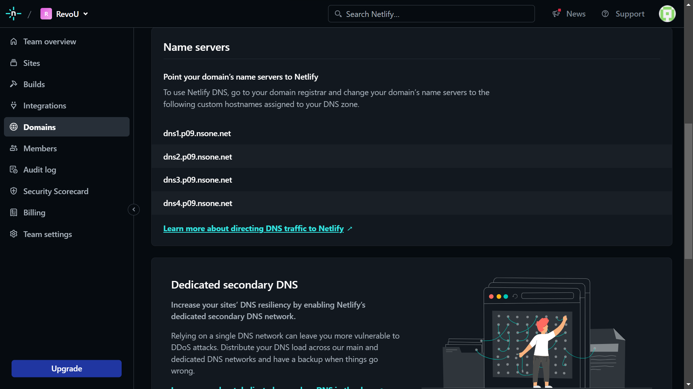

# How To Automate Changes (auto-deploy) of your website

## 1. Register on Netlify

- Open https://www.netlify.com/, and hit the sign up button
  
- Choose one of sign up option. On this case, Github is more recommended.
  
- Authorize your Github account to Netlify, and here the interface when you success authorized your account.
  
- Now, hit the **Sites** menu. After that, press **Add new site** button, and choose **Import an existing project**
  
- You can choose one option of deployment source. For now, we using **Deploy with Github**
  
- Authorized your Github account. If success, it will displayed like this.
  
- Now you can choose repository that you want to deploy.
  
- Setup your base directory by writing name of your directory.  
  
- Now your website is On Air !

## 2. Buy Domain for your website

- After deploying your website, now you try buy domain. There are so many website out there that sell domain, for now we will using **Niagahoster**.
- Open https://www.niagahoster.co.id/, press login button.
  
- After login, hit the **Domains** menu, and choose **Get a new Domain**.
  
- Now you can enter name of your domain based on website that you have. Choose domain according to your budget.
  
- Fill the form for the payment.
  
- When all ready, you can start setup your domain in **Netlify**.
  
- Now go to **Netlify** again and choose **Domain** menu. Copy all the name server.
  
- Paste it on **DNS/Nameservers** by clicking **Change Nameservers**.
  
- Now your website can be accessed using the new domain name.

## 3. Final Result

Finnaly, now your website have auto-deploy feature !
You can check one of my website here https://quadrat.biz.id